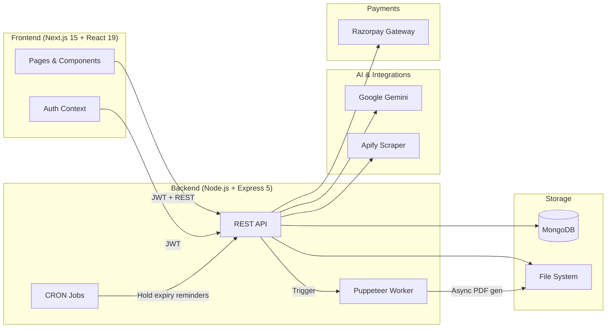
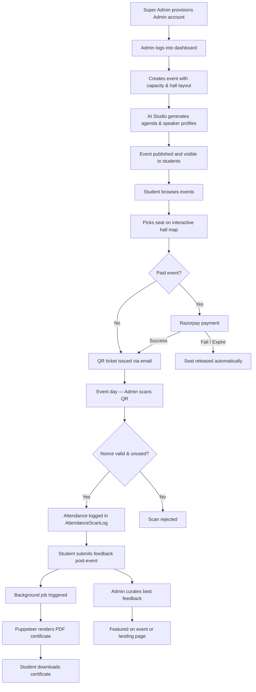
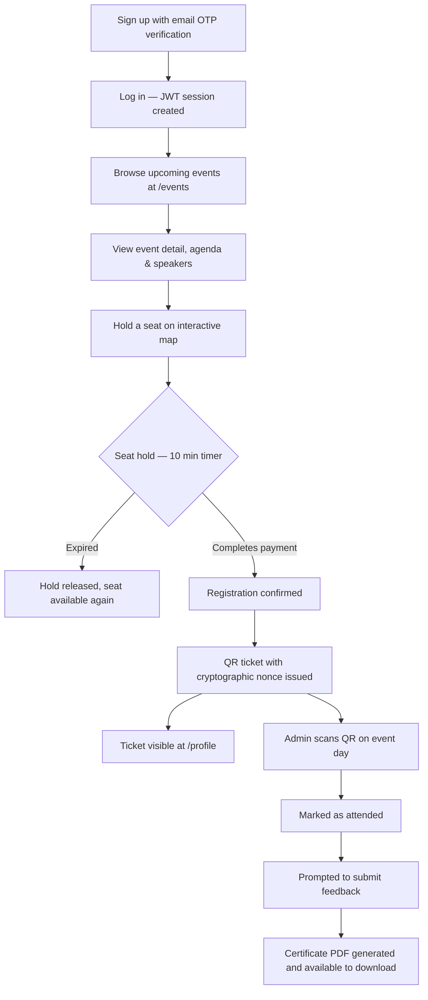
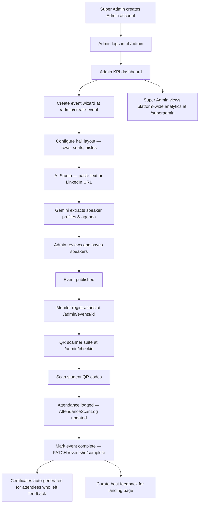

# TechTrek 2026


---

## 1. Project Overview

TechTrek 2026 is a scalable and robust Event Management platform designed specifically for the "Industry Awareness Summits" initiative. The platform aims to bridge the gap between academia and industry by aligning with the Viksit Bharat vision, securely managing students, events, registrations, attendances through QR codes, and dynamically issuing certificates.

---

## 2. Purpose

The main goal of TechTrek is to provide a seamless event lifecycle platform: from event creation, seating plan implementation, and automated AI-powered agenda generation, to secure student check-ins during the event day and post-event feedback-driven certificate disbursements.

---

## 3. Tech Stack

### 3.1 Frontend
- **Framework:** [Next.js](https://nextjs.org/) (App Router, v15+)
- **Library:** React 19
- **Styling:** Tailwind CSS v4, custom vanilla CSS animations
- **Animations:** framer-motion (`motion`)
- **Icons:** `lucide-react`
- **PDF/Certificate Viewing:** `jspdf`, `svg2pdf.js`

### 3.2 Backend
- **Runtime:** Node.js
- **Framework:** Express.js 5.x
- **Database:** MongoDB & Mongoose
- **Authentication:** JWT, bcryptjs
- **Payment Gateway:** Razorpay
- **PDF Generation:** Puppeteer (headless browser rendering of HTML templates)
- **Utilities:** Nodemailer (Emails), `qrcode`

### 3.3 AI & Integrations
- **Generative AI:** Google's Gemini
- **Web Scraping:** Apify (for LinkedIn Speakers context injection, if applicable)

---

## 4. Main Functional Modules

### 4.1 Authentication & Role Management
- **Users:** Secure Sign up / Log in with OTP verification via Email.
- **Roles:** `student`, `admin`, `superAdmin`.
- **Session Management:** JWT based session, explicit tracking of Admin Sessions.

### 4.2 Event & Seat Management
- **Event Catalog:** Track UPCOMING and COMPLETED events, including multi-day events.
- **Seat Booking:** Holds seating for users (temp hold) leading to confirmed bookings after successful transactions.
- **Hall Layout:** Interactive dynamic venue mapping depending on the respective college/venue capacity.

### 4.3 Payment & Registration
- Razorpay setup for processing secure payments for paid events.
- Registrations flow handles generating tickets, keeping track of waitlisted counts vs checked-in counts.

### 4.4 Robust QR Check-in System
- Dynamic rotating QR codes with cryptographic nonces preventing replay and malicious unauthorized scans.
- `AttendanceScanLog` keeps an immutable record of check-in interactions.

### 4.5 Automation & Background Jobs
- **CRON Jobs:** Reminders for temporary seat holds expiring in 10 minutes.
- **Certificate Generation:** Puppeteer asynchronously builds dynamic certificates post-event once attendees leave their feedback.

### 4.6 AI Studio (Admin) 🤖
- **Speaker Extractor:** Parse unstructured text or LinkedIn URLs into comprehensive speaker objects (Name, Bio, Role, Tags, Match Scores) using Gemini AI.

### 4.7 Feedback Curation Engine
- Students provide feedback.
- Admins can feature the best feedback on the global landing page or the specific event page.

---

## 5. Architecture Flows and Diagrams

### 5.1 System Architecture



### 5.2 Full End-to-End Workflow



### 5.3 Student Workflow



### 5.4 Admin Workflow



---

## 6. End-to-End Workflow

1. **Super Admin** provisions an **Admin** account.
2. **Admin** logs into the dashboard, creates an Event, sets up the Hall Layout, and uses the **AI Studio** to automate building the agenda and speaker profiles.
3. **Student** registers securely, chooses an interactive seat map, completes **Razorpay** payment (if applicable), and receives a Digital QR Ticket.
4. Temporary holds and session expiration cleanly release seats if payments fail or expire.
5. On Event Day, the **Admin** scans the student's QR code. The system checks cryptographic nonces and logs their attendance.
6. Post Event, the **Student** is prompted to submit Event Feedback.
7. Upon feedback submission, a background job invokes Puppeteer to render and generate a personalized PDF certificate for the student to download.

---

## 7. Data Model Summary

Under `/backend/models`:
- `User` — Basic user info, role (student/admin), OTP metadata.
- `Event` — Event logistics, agenda, speakers metadata, capacity limits.
- `HallLayout` — Configuration array matching real-world venue layout (rows, seats, aisles).
- `SeatBooking` — Temporary and permanent records for booked specific seats per event.
- `Registration` — Ties User and Event. Tracks Razorpay data, QR nonces, secure hashes, refund statuses.
- `QrNonce`, `RegistrationToken` — Active and Deny-listed validation hashes for QR checks.
- `AttendanceScanLog`, `CancellationAuditLog` — Immutable ledgers keeping track of check-in metrics.
- `Feedback` — Student ratings and comments.
- `Speaker` — AI extracted entities representing a person and their expertise.

---

## 8. List of APIs

### 8.1 Authentication (`/api/auth`)
- `POST /signup`, `POST /login`, `GET /me`
- `POST /forgot-password`, `POST /verify-otp`, `POST /reset-password`, `POST /change-password`

### 8.2 Events (`/api/events`)
- `GET /` (List public events), `GET /:id`
- `POST /` (Admin create event), `PUT /:id` (Update), `PATCH /:eventId/complete`
- `GET /analytics` & `GET /mine` & `GET /dashboard/:eventId` (Admin statistics)
- `POST /:eventId/feedback` (Public) & `GET /:eventId/feedback/admin` (Admin viewing)

### 8.3 Registration & Seats (`/api/registration`, `/api/seats`)
- `POST /registration` (Book), `GET /registration/my`
- `POST /seats/hold`, `POST /seats/confirm`, `DELETE /seats/release`

### 8.4 Check-in & Security (`/api/checkin`)
- `POST /checkin` (Scan QR), `GET /checkin/stats/:eventId`

### 8.5 SuperAdmin (`/api/superadmin`)
- `POST /admins`, `GET /admins`, `PATCH /admins/:id/toggle`
- `GET /analytics`, `GET /events`

---

## 9. Frontend Route Map

| Route Path | Description | Access |
|---|---|---|
| `/` | Landing page | Public |
| `/login`, `/signup` | User authentication pages | Public |
| `/profile` | Student dashboard (My Tickets, Details) | Student |
| `/events` | List all events | Public |
| `/events/[id]` | Event specific view, details, agenda | Public |
| `/admin` | Admin KPI Dashboard | Admin |
| `/admin/create-event` | Complete wizard to create events | Admin |
| `/admin/events` | List of events created by Admin | Admin |
| `/admin/events/[id]` | Dashboard per event | Admin |
| `/admin/ai-studio` | AI Agenda & Speaker pipeline | Admin |
| `/admin/checkin` | QR Scanner suite | Admin |
| `/superadmin` | Platform wide usage and admin management | SuperAdmin |

---

## 10. Local Development Setup

### 10.1 Pre-requisites
- Node.js (v18+ recommended)
- MongoDB running locally or a MongoDB Atlas URI

### 10.2 Backend Setup
1. Open terminal and `cd backend`
2. Install dependencies:
   ```bash
   npm install
   ```
3. Set up the `.env` file (cp `.env.example` `.env`):
   ```env
   PORT=5000
   MONGO_URI=mongodb+srv://...
   JWT_SECRET=your_super_secret

   # Email Configuration
   EMAIL_USER=your_email@gmail.com
   EMAIL_PASS=your_app_password

   # Payments
   RAZORPAY_KEY_ID=...
   RAZORPAY_KEY_SECRET=...
   GEMINI_API_KEY=...
   APIFY_API_KEY=...
   ```
4. Run the dev server:
   ```bash
   npm run start
   ```

### 10.3 Frontend Setup
1. Open terminal and `cd frontend`
2. Install dependencies:
   ```bash
   npm install
   ```
3. Set up env if required (`.env.local`):
   ```env
   NEXT_PUBLIC_API_URL=http://localhost:5000/api
   ```
4. Run the development environment:
   ```bash
   npm run dev
   ```
5. Navigate to `http://localhost:3000`

---

## 11. AI in the Project

The platform heavily innovates on standard workflows by utilizing Google's Gemini to completely bypass manual data entry for large conferences.

**11.1 AI Studio — Speaker Extractor (`/admin/ai-studio`):** Admins can paste raw text or a LinkedIn URL. A dedicated prompt asks Gemini to parse the text into a well-structured JSON document, deducing their expertise (`tags`), seniority hierarchy, and scoring their proficiency (Keynotes vs Panels vs Workshops).